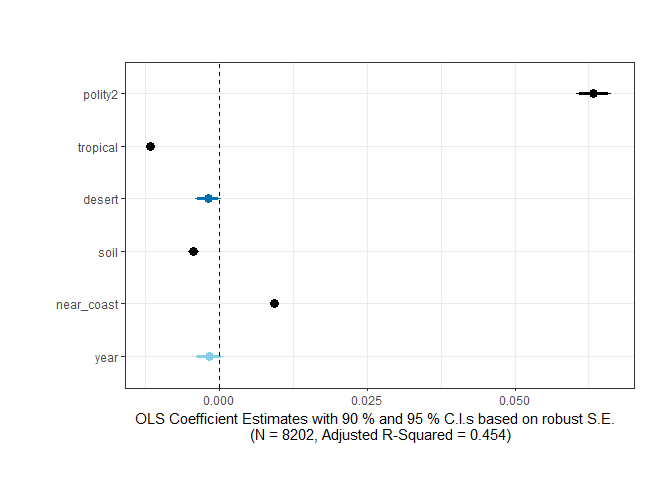

QuickCoefPlot
================
Sondre U. Solstad

Easy OLS Coefficient Plots with options in R
============================================

QuickCoefPlot is an easy interface for linear regression coefficient plots in R. This includes the option to request robust and clustered standard errors, automatic labeling, and easy selection of coefficients to plot.

Written by Sondre U. Solstad, Princeton University (<ssolstad@princeton.edu>). Send me an email if you find this package useful or want to suggest an improvement or feature.

Installation instructions:

``` r
library(devtools)
install_github("sondreus/QuickCoefPlot")
```

Example:
--------

``` r
library(QuickCoefPlot)

# Loading data
mydata <- readRDS("3d_example.RDS")

# Use the QuickCoefPlot to produce a regression table     
model <- lm(log_gdppc_mad ~ upop + polity2, data = mydata)

QuickCoefPlot(model)
```



Arguments:
----------

-   **data** - Data frame in which all model variables are located.
-   **iv.vars** - Vector of independent variable names in dataset (e.g. c("gdppc", "pop"))
-   **iv.vars.names** - *(Optional)* Vector of desired independent variable names in table output (e.g. c("GDP per capita", "Population")). Defaults to values in "iv.vars" if none provided.
-   \*\*model Data frame in which all model variables are located.
-   **iv.vars.names** *(Optional)* Vector of desired independent variable names in table output (e.g. c("GDP per capita", "Population")). Defaults to values in "iv.vars" if none provided.
-   **plot.title** *(Optional)* Specifies the title of the coefficient plot. Defaults to no title.
-   **xlim** *(Optional)* Vector of limits on x-axis of plot. If none supplied, this is automatically selected by ggplot.
-   \*\*include.only *(Optional)* Vector of coefficients by number to keep in the plot (e.g. c(1, 2, 6)). If none specified, defaults to all.
-   **robust.se** *(Optional)* If TRUE, returns robust standard errors calculated using a sandwich estimator from the "sandwich" package. Defaults to TRUE (i.e. robust rather than normal standard errors).
-   **cluster** *(Optional)* Name of variable by which cluster-robust standard errors should be computed using the cluster.vcov command of the multiwayvcov package. If this variable is not in the model, a data frame common to both the model variables and the clustering variable must be supplied.
-   **cluster.vars.names** *(Optional)* Desired name or label of clustering variable to be reported in table output (e.g. "Country" yields a note on the bottom of the table reading "Country-Clustered Standard Errors in Parenthesis"). If cluster specified but no "cluster.vars.names" provided, "Cluster-Robust Standard Errors in Parenthesis" is reported.
-   ***colors.off** *(Optional)\* If TRUE turns off default color scheme (sky-blue if p &gt; 0.1, blue if p &lt; 0.1, dark blue if p &lt; 0.05, and black if p &lt; 0.01)
-   **plot.margin** *(Optional)* Vector of plot margins in centimeters. Defaults to (1, 1, 1, 1).
-   **text.size** *(Optional)* Text size for plot elements.
-   **hide.summary.lines** *(Optional)* Vector of summary lines to hide in plot output. If none supplied, defaults to none.
-   **horserace** *(Optional)* If TRUE Produces a table comparing t-statistics instead of a coefficient plot.
